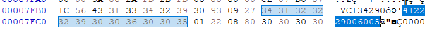
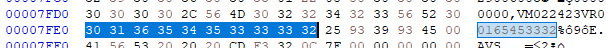
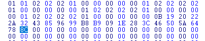

# HFM ecu binaries code and reverse engineering

This repo is for dissecting HFM ecus (BOSCH and VDO) from 90s mercedes, with the intent of finding relevant mapping.

# ECU info

At 0x7FBC is located some ecu info, in the casing it says:
412.229/006.005. This is probably some HW or SW info.

At 0x7FE0 there is the Part Number of the ecu.

# Info about the Maps

for what i could understand, the "terminator code" is 8C hex.
